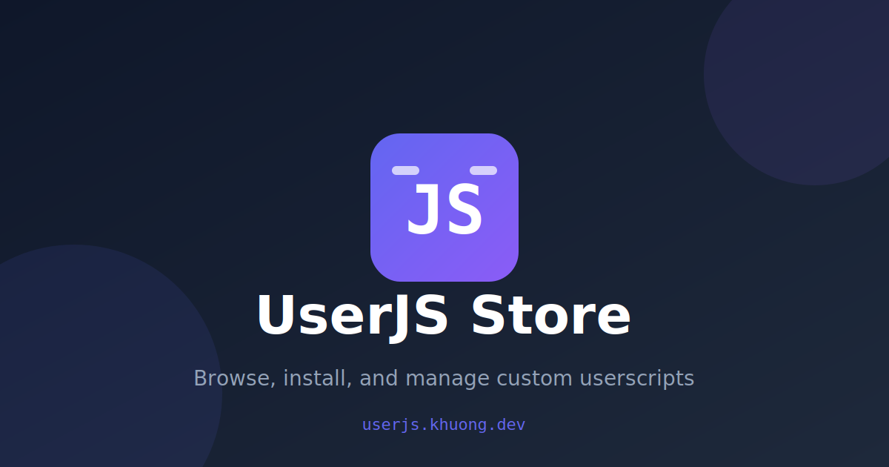
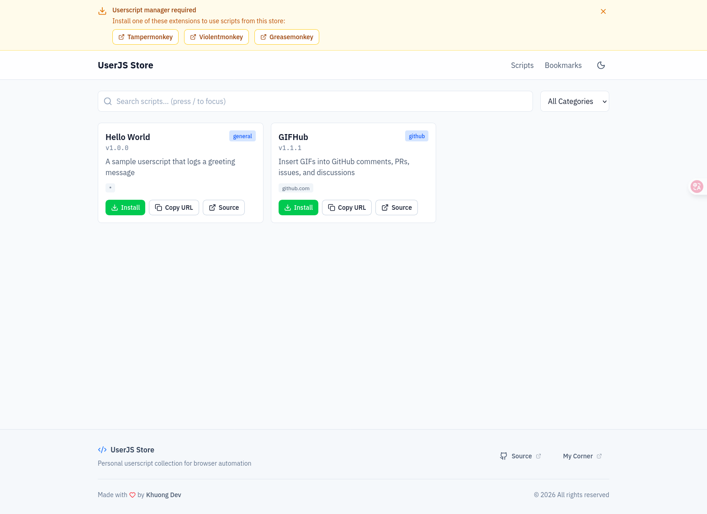
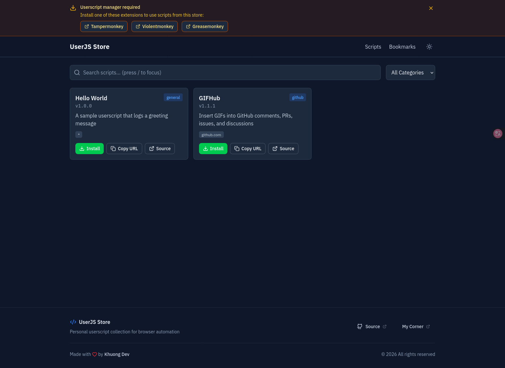
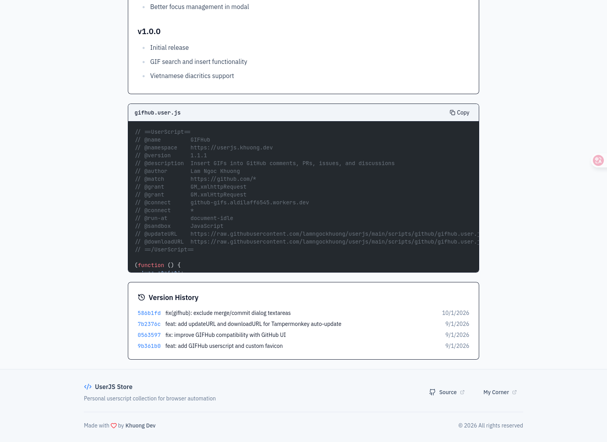
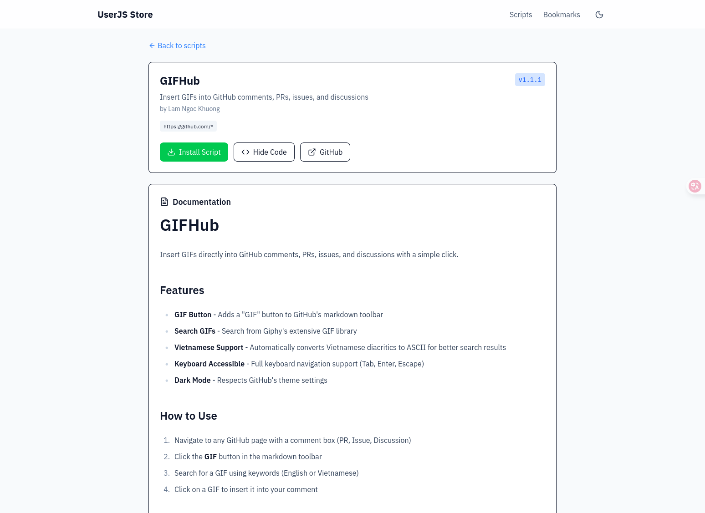
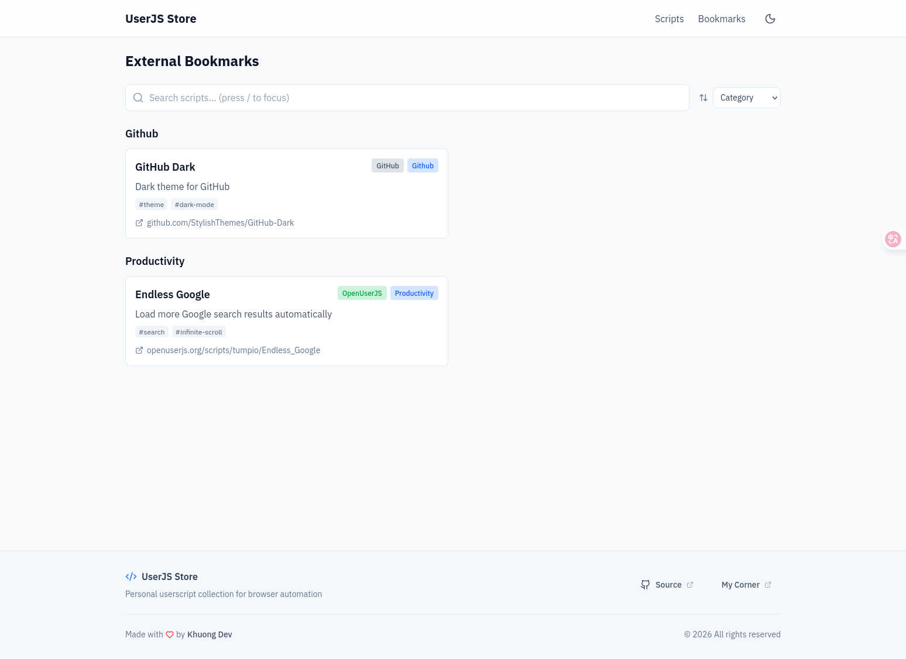

<p align="center">
  
</p>

<h1 align="center">UserJS Store</h1>

<p align="center">
  <a href="https://github.com/lamngockhuong/userjs/actions/workflows/ci.yml"></a>
  <a href="https://github.com/lamngockhuong/userjs/actions/workflows/deploy.yml"></a>
  <a href="LICENSE"></a>
  <a href="https://www.typescriptlang.org/"></a>
  <a href="https://vuejs.org/"></a>
  <a href="https://userjs.khuong.dev"></a>
</p>

<p align="center">
  A personal userscript hosting platform built with Vue 3 and Vite.<br>
  <a href="https://userjs.khuong.dev"><strong>Live Site »</strong></a>
</p>

## Preview

### Home Page

| Light Mode                                | Dark Mode                               |
| ----------------------------------------- | --------------------------------------- |
|  |  |

### Script Detail

| Code Preview                                 | Documentation                                 |
| -------------------------------------------- | --------------------------------------------- |
|  |  |

### Bookmarks



## Features

- Browse and install userscripts
- Fuzzy search with Fuse.js
- Category filtering
- Script version history from GitHub commits
- Syntax-highlighted code preview with Shiki
- External bookmarks collection
- Dark mode support
- Dynamic page titles per route
- Keyboard shortcuts (/, Shift+G, Shift+B, Shift+D)

## Tech Stack

- Vue 3 (Composition API)
- Vite 7
- TypeScript
- Tailwind CSS v4
- Vue Router (hash mode)
- Fuse.js (fuzzy search)
- Shiki (syntax highlighting)
- Biome (linting)
- Prettier (markdown formatting)

## Development

```bash
# Install dependencies
pnpm install

# Start dev server
pnpm dev

# Build for production
pnpm build

# Type check
pnpm type-check

# Lint code
pnpm lint

# Auto-fix lint issues
pnpm lint:fix

# Format all files
pnpm format
```

## Adding Scripts

1. Add `.user.js` files to `scripts/<category>/`
2. Optionally add `.md` file with same name for documentation
3. Run `pnpm build` to regenerate the index
4. Scripts are auto-indexed with metadata from userscript headers

## License

MIT
