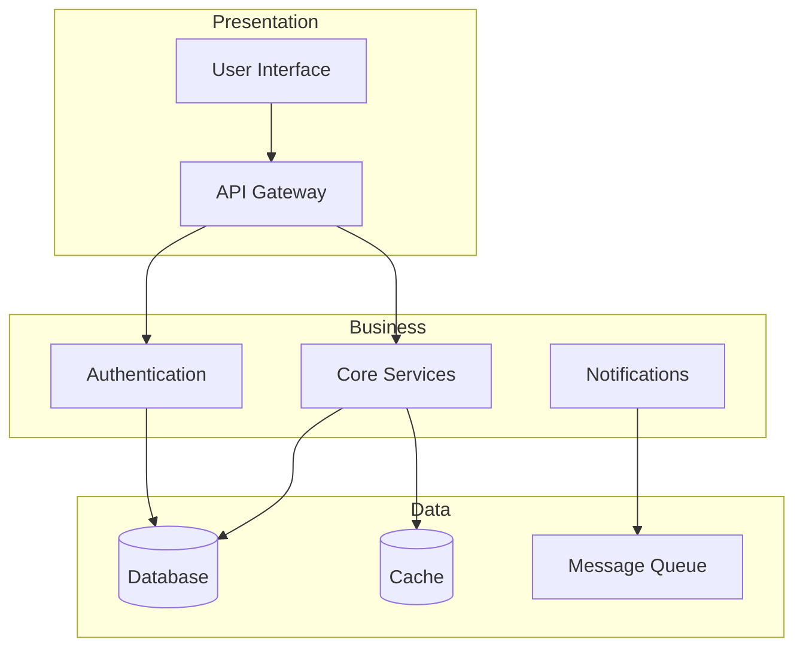

# Long Document Test

Testing performance with a longer document containing many sections.

[[toc]]

## Introduction

This document is designed to test the Markdown Viewer's performance with a large amount of content.
It includes multiple sections, code blocks, tables, and various markdown elements to simulate a
real-world technical document.

## Chapter 1: Getting Started

### 1.1 Prerequisites

Before you begin, ensure you have the following installed:

- Node.js 18+ (LTS recommended)
- npm or pnpm package manager
- Git version control
- A modern web browser

### 1.2 Installation

Clone the repository and install dependencies:

```bash
# Clone the repository
git clone https://github.com/example/project.git
cd project

# Install dependencies
pnpm install

# Start development server
pnpm dev
```

### 1.3 Configuration

Create a configuration file at the project root:

```typescript
// config.ts
export interface Config {
  apiUrl: string;
  debug: boolean;
  features: {
    darkMode: boolean;
    analytics: boolean;
    notifications: boolean;
  };
}

export const config: Config = {
  apiUrl: process.env.API_URL ?? "https://api.example.com",
  debug: process.env.NODE_ENV === "development",
  features: {
    darkMode: true,
    analytics: true,
    notifications: false,
  },
};
```

## Chapter 2: Architecture

### 2.1 System Overview

The system follows a layered architecture pattern:



### 2.2 Component Structure

| Component    | Responsibility   | Technology        |
| ------------ | ---------------- | ----------------- |
| Frontend     | User interface   | Vue 3, TypeScript |
| API Gateway  | Request routing  | Express, Node.js  |
| Auth Service | Authentication   | JWT, OAuth2       |
| Core Service | Business logic   | Node.js           |
| Database     | Data persistence | PostgreSQL        |
| Cache        | Performance      | Redis             |
| Queue        | Async processing | RabbitMQ          |

### 2.3 Data Flow

1. User initiates action through UI
2. Request passes through API Gateway
3. Authentication middleware validates token
4. Request routed to appropriate service
5. Service processes business logic
6. Data retrieved/stored in database
7. Response returned to client

The mathematical model for response time is:

$$
T_{total} = T_{network} + T_{auth} + T_{process} + T_{db} + T_{cache}
$$

Where:

- $T_{network}$ is network latency
- $T_{auth}$ is authentication time
- $T_{process}$ is processing time
- $T_{db}$ is database query time
- $T_{cache}$ is cache lookup time (typically $\approx 0$ on cache hit)

## Chapter 3: API Reference

### 3.1 Authentication

#### POST /auth/login

Authenticate a user and receive access tokens.

**Request:**

```json
{
  "email": "user@example.com",
  "password": "securepassword123"
}
```

**Response:**

```json
{
  "accessToken": "eyJhbGciOiJIUzI1NiIsInR5cCI6IkpXVCJ9...",
  "refreshToken": "dGhpcyBpcyBhIHJlZnJlc2ggdG9rZW4...",
  "expiresIn": 3600,
  "tokenType": "Bearer"
}
```

#### POST /auth/refresh

Refresh an expired access token.

**Request Headers:**

| Header        | Value                   |
| ------------- | ----------------------- |
| Authorization | `Bearer {refreshToken}` |

**Response:** Same as login response.

### 3.2 Users

#### GET /users

List all users (admin only).

**Query Parameters:**

| Parameter | Type   | Default   | Description           |
| --------- | ------ | --------- | --------------------- |
| page      | number | 1         | Page number           |
| limit     | number | 20        | Items per page        |
| sort      | string | createdAt | Sort field            |
| order     | string | desc      | Sort order (asc/desc) |

**Response:**

```json
{
  "data": [
    {
      "id": "550e8400-e29b-41d4-a716-446655440000",
      "email": "user@example.com",
      "name": "John Doe",
      "role": "user",
      "createdAt": "2024-01-15T10:30:00Z"
    }
  ],
  "pagination": {
    "page": 1,
    "limit": 20,
    "total": 150,
    "totalPages": 8
  }
}
```

#### GET /users/:id

Get a specific user by ID.

#### POST /users

Create a new user.

#### PUT /users/:id

Update a user.

#### DELETE /users/:id

Delete a user (soft delete).

### 3.3 Resources

#### GET /resources

List all resources.

```typescript
interface Resource {
  id: string;
  name: string;
  type: "document" | "image" | "video";
  size: number;
  mimeType: string;
  url: string;
  metadata: Record<string, unknown>;
  createdAt: string;
  updatedAt: string;
}

interface ResourceListResponse {
  data: Resource[];
  pagination: Pagination;
}
```

## Chapter 4: Development Guide

### 4.1 Project Structure

```
project/
├── src/
│   ├── components/
│   │   ├── common/
│   │   │   ├── Button.vue
│   │   │   ├── Input.vue
│   │   │   ├── Modal.vue
│   │   │   └── Table.vue
│   │   ├── layout/
│   │   │   ├── Header.vue
│   │   │   ├── Sidebar.vue
│   │   │   └── Footer.vue
│   │   └── features/
│   │       ├── auth/
│   │       ├── users/
│   │       └── resources/
│   ├── composables/
│   │   ├── useAuth.ts
│   │   ├── useApi.ts
│   │   └── useToast.ts
│   ├── services/
│   │   ├── api.ts
│   │   ├── auth.ts
│   │   └── storage.ts
│   ├── stores/
│   │   ├── auth.ts
│   │   └── ui.ts
│   ├── types/
│   │   └── index.ts
│   └── utils/
│       ├── format.ts
│       └── validation.ts
├── tests/
│   ├── unit/
│   └── e2e/
├── docs/
└── scripts/
```

### 4.2 Coding Standards

#### TypeScript Guidelines

1. Use strict mode
2. Prefer interfaces over types for objects
3. Use explicit return types
4. Avoid `any` - use `unknown` if needed

```typescript
// ✅ Good
interface User {
  id: string;
  name: string;
}

function getUser(id: string): Promise<User | null> {
  return api.get(`/users/${id}`);
}

// ❌ Bad
type User = {
  id: any;
  name: any;
};

function getUser(id) {
  return api.get(`/users/${id}`);
}
```

#### Vue Component Guidelines

1. Use Composition API with `<script setup>`
2. Props and emits should be typed
3. Composables for reusable logic

```vue
<script setup lang="ts">
interface Props {
  title: string;
  count?: number;
}

const props = withDefaults(defineProps<Props>(), {
  count: 0,
});

const emit = defineEmits<{
  update: [value: number];
  close: [];
}>();
</script>
```

### 4.3 Testing

#### Unit Tests

```typescript
import { describe, it, expect, vi } from "vitest";
import { useAuth } from "@/composables/useAuth";

describe("useAuth", () => {
  it("should login successfully", async () => {
    const { login, user, isAuthenticated } = useAuth();

    await login("user@example.com", "password");

    expect(isAuthenticated.value).toBe(true);
    expect(user.value).toBeDefined();
    expect(user.value?.email).toBe("user@example.com");
  });

  it("should handle login failure", async () => {
    const { login, error } = useAuth();

    await login("invalid@example.com", "wrong");

    expect(error.value).toBe("Invalid credentials");
  });
});
```

#### E2E Tests

```typescript
import { test, expect } from "@playwright/test";

test.describe("Authentication", () => {
  test("user can login", async ({ page }) => {
    await page.goto("/login");

    await page.fill('[data-testid="email"]', "user@example.com");
    await page.fill('[data-testid="password"]', "password");
    await page.click('[data-testid="submit"]');

    await expect(page).toHaveURL("/dashboard");
    await expect(page.locator('[data-testid="user-menu"]')).toBeVisible();
  });
});
```

## Chapter 5: Deployment

### 5.1 Environment Configuration

| Variable       | Required | Default | Description                          |
| -------------- | -------- | ------- | ------------------------------------ |
| `NODE_ENV`     | Yes      | -       | Environment (development/production) |
| `PORT`         | No       | 3000    | Server port                          |
| `DATABASE_URL` | Yes      | -       | PostgreSQL connection string         |
| `REDIS_URL`    | No       | -       | Redis connection string              |
| `JWT_SECRET`   | Yes      | -       | JWT signing secret                   |
| `JWT_EXPIRY`   | No       | 1h      | Token expiry time                    |

### 5.2 Docker Deployment

```dockerfile
# Dockerfile
FROM node:18-alpine AS builder
WORKDIR /app
COPY package*.json ./
RUN npm ci
COPY . .
RUN npm run build

FROM node:18-alpine AS runner
WORKDIR /app
ENV NODE_ENV=production
COPY --from=builder /app/dist ./dist
COPY --from=builder /app/node_modules ./node_modules
COPY --from=builder /app/package.json ./
EXPOSE 3000
CMD ["node", "dist/server.js"]
```

```yaml
# docker-compose.yml
version: "3.8"

services:
  app:
    build: .
    ports:
      - "3000:3000"
    environment:
      - NODE_ENV=production
      - DATABASE_URL=postgres://user:pass@db:5432/app
      - REDIS_URL=redis://cache:6379
    depends_on:
      - db
      - cache

  db:
    image: postgres:15-alpine
    volumes:
      - pgdata:/var/lib/postgresql/data
    environment:
      - POSTGRES_USER=user
      - POSTGRES_PASSWORD=pass
      - POSTGRES_DB=app

  cache:
    image: redis:7-alpine

volumes:
  pgdata:
```

### 5.3 Kubernetes Deployment

```yaml
apiVersion: apps/v1
kind: Deployment
metadata:
  name: app
spec:
  replicas: 3
  selector:
    matchLabels:
      app: myapp
  template:
    metadata:
      labels:
        app: myapp
    spec:
      containers:
        - name: app
          image: myregistry/myapp:latest
          ports:
            - containerPort: 3000
          env:
            - name: NODE_ENV
              value: production
          resources:
            requests:
              memory: "128Mi"
              cpu: "100m"
            limits:
              memory: "256Mi"
              cpu: "500m"
```

## Chapter 6: Troubleshooting

### 6.1 Common Issues

#### Issue: Database Connection Failed

**Symptoms:**

- Error: `ECONNREFUSED` or `Connection timeout`
- Application fails to start

**Solutions:**

1. Check DATABASE_URL is correct
2. Verify database server is running
3. Check firewall rules
4. Verify credentials

```bash
# Test connection
psql $DATABASE_URL -c "SELECT 1"
```

#### Issue: JWT Token Invalid

**Symptoms:**

- 401 Unauthorized responses
- "Token expired" or "Invalid signature" errors

**Solutions:**

1. Check JWT_SECRET matches between services
2. Verify token hasn't expired
3. Check clock synchronization

#### Issue: High Memory Usage

**Symptoms:**

- OOMKilled in Kubernetes
- Slow response times
- Process crashes

**Solutions:**

1. Increase memory limits
2. Check for memory leaks
3. Enable garbage collection logging

```bash
node --max-old-space-size=512 --expose-gc dist/server.js
```

### 6.2 Performance Optimization

| Area     | Technique            | Expected Improvement       |
| -------- | -------------------- | -------------------------- |
| Database | Add indexes          | 50-90% faster queries      |
| Database | Connection pooling   | Reduce connection overhead |
| API      | Response compression | 60-80% smaller payloads    |
| API      | Caching              | 90%+ reduction in DB calls |
| Frontend | Code splitting       | 40-60% faster initial load |
| Frontend | Image optimization   | 50-80% smaller images      |

### 6.3 Monitoring

Set up monitoring with the following metrics:

- **Response Time**: p50, p95, p99 latencies
- **Error Rate**: 4xx and 5xx responses
- **Throughput**: Requests per second
- **Saturation**: CPU, memory, disk usage
- **Dependencies**: Database, cache, queue health

## Appendix A: Glossary

| Term  | Definition                                   |
| ----- | -------------------------------------------- |
| API   | Application Programming Interface            |
| JWT   | JSON Web Token                               |
| CORS  | Cross-Origin Resource Sharing                |
| CRUD  | Create, Read, Update, Delete                 |
| REST  | Representational State Transfer              |
| SPA   | Single Page Application                      |
| SSR   | Server-Side Rendering                        |
| CI/CD | Continuous Integration/Continuous Deployment |

## Appendix B: References

1. Vue 3 Documentation - https://vuejs.org
2. TypeScript Handbook - https://www.typescriptlang.org/docs
3. PostgreSQL Documentation - https://www.postgresql.org/docs
4. Redis Documentation - https://redis.io/docs
5. Docker Documentation - https://docs.docker.com
6. Kubernetes Documentation - https://kubernetes.io/docs

---

_Document version: 1.0.0_ _Last updated: 2024-01-15_ _Author: Development Team_
