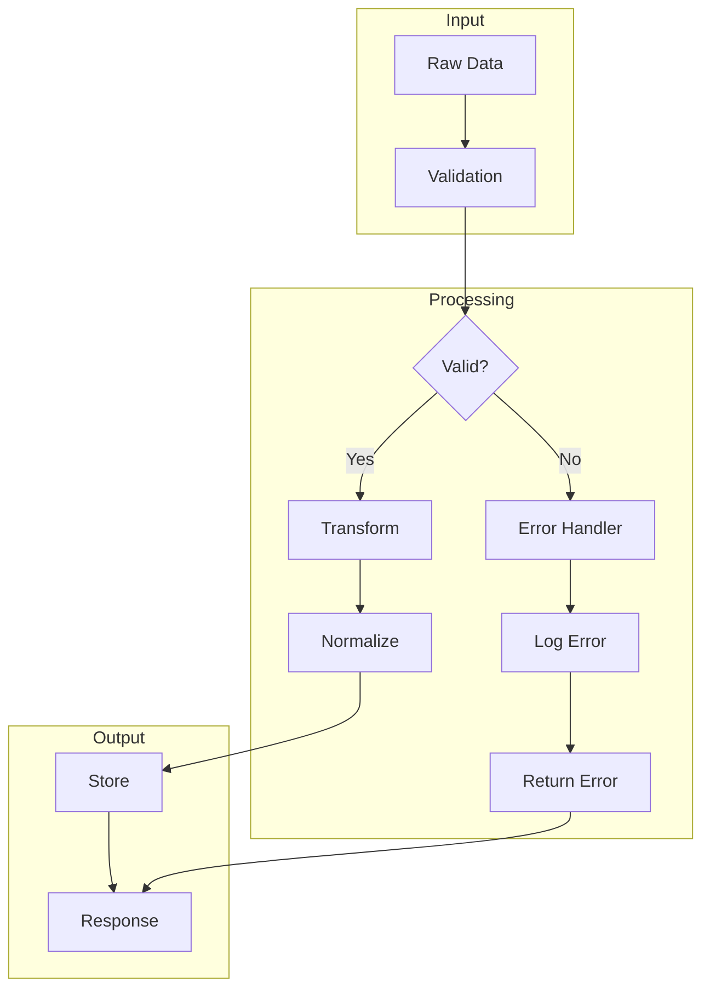
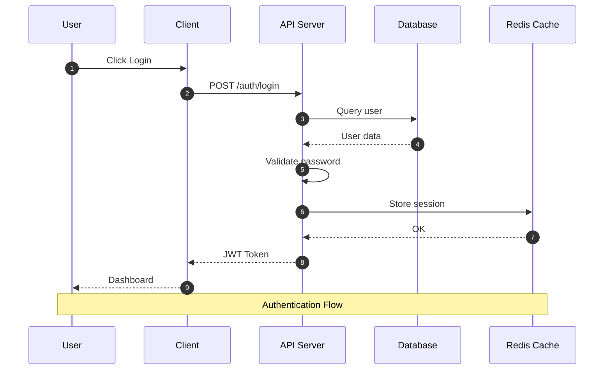
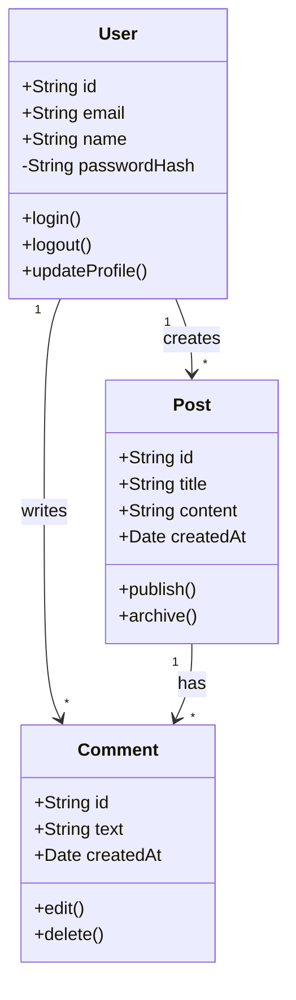
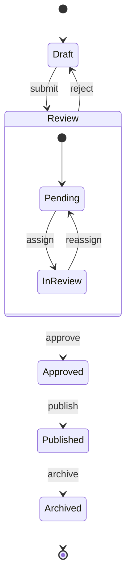
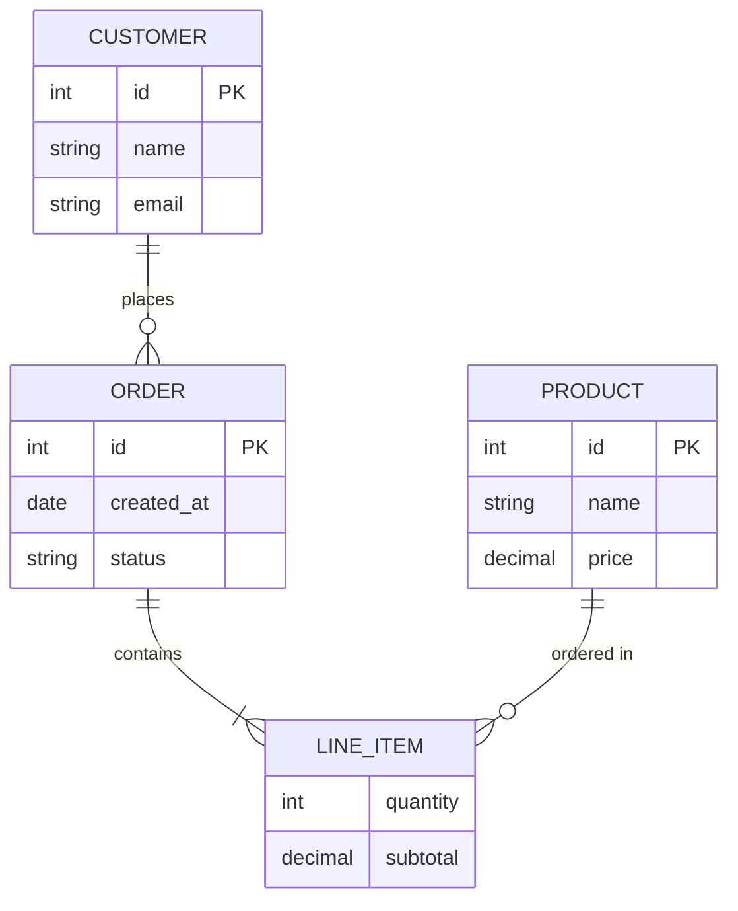
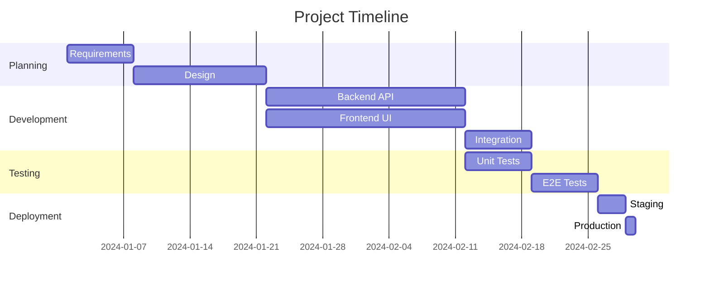
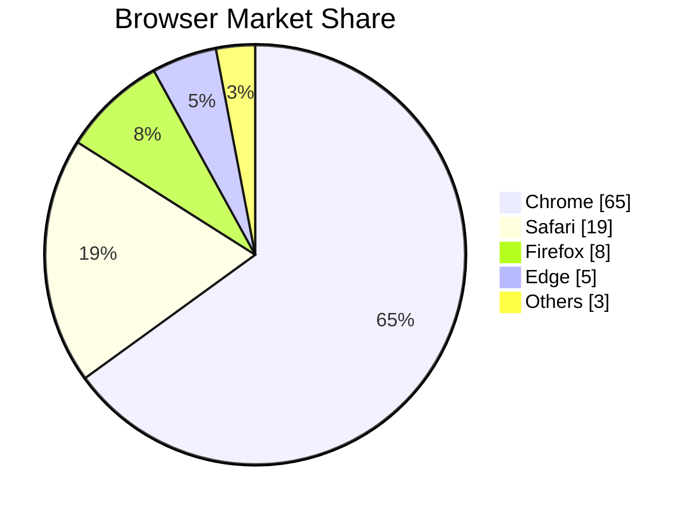
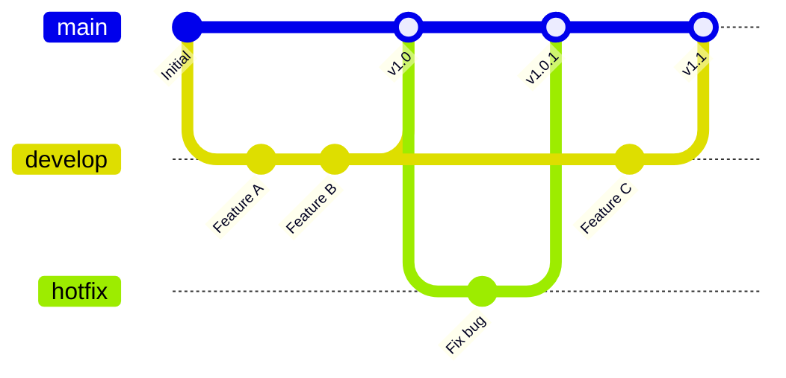
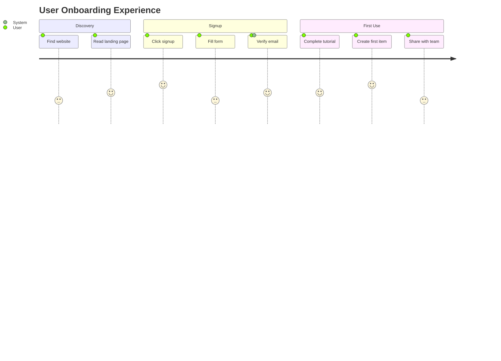
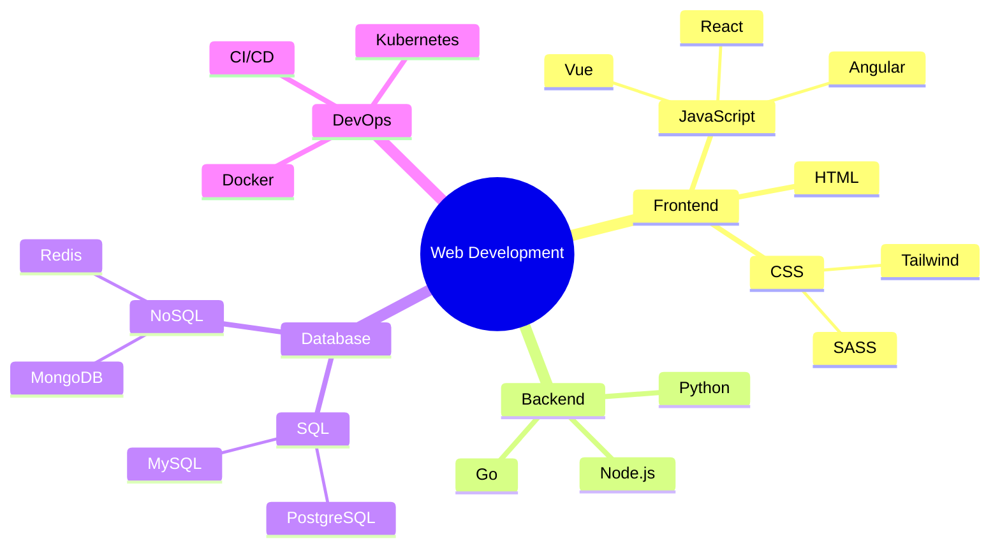

# Mermaid Diagrams Test

Testing various Mermaid diagram types.

[[toc]]

## Flowchart

## Sequence Diagram

## Class Diagram

## State Diagram

## Entity Relationship

## Gantt Chart

## Pie Chart

## Git Graph

## Journey Map

## Mindmap

