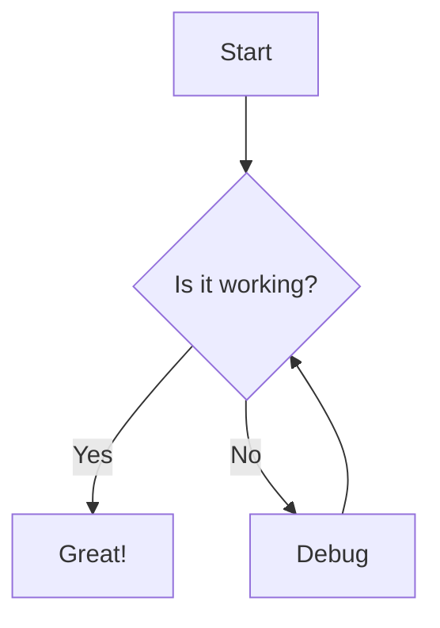

# Test Markdown Document

This file is used to test the Markdown Viewer userscript.

## Basic Formatting

**Bold text**, *italic text*, `inline code`, ~~strikethrough~~

> This is a blockquote

## Links and Images

[Example Link](https://example.com)

## Code Block

```javascript
function hello() {
  console.log('Hello, World!');
}
```

```python
def greet(name):
    print(f"Hello, {name}!")
```

## Table

| Feature | Status |
|---------|--------|
| GFM | ✅ |
| Syntax Highlighting | ✅ |
| Math | ✅ |
| Mermaid | ✅ |

## Task List

- [x] Completed task
- [ ] Pending task

## Math (KaTeX)

Inline: $E = mc^2$

Block:
$$
\int_{-\infty}^{\infty} e^{-x^2} dx = \sqrt{\pi}
$$

## Mermaid Diagram



## Footnotes

Here is a footnote reference[^1].

[^1]: This is the footnote content.

## Horizontal Rule

---

## Nested List

1. First item
   - Nested bullet
   - Another nested
2. Second item
   1. Nested number
   2. Another nested

## End

If you can see this rendered properly, the Markdown Viewer is working! 🎉
